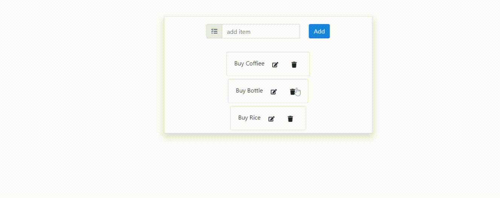

# Todo App (React.js and Node.js Server)

A basic understanding and using practically react components, hooks, packages, axios and others. Also connected to the Node.js, Express.js Server and MongoBD Database.

## Locally Run Script

To open the project locally, you can run:

### `git clone`

Firstly clone the repository locally.

### `npm install`

Install the dependencies.

### `npm start`

Open [http://localhost:3000](http://localhost:3000) to view it in your browser.

The page will reload when you make changes.
You may also see any lint errors in the console.

